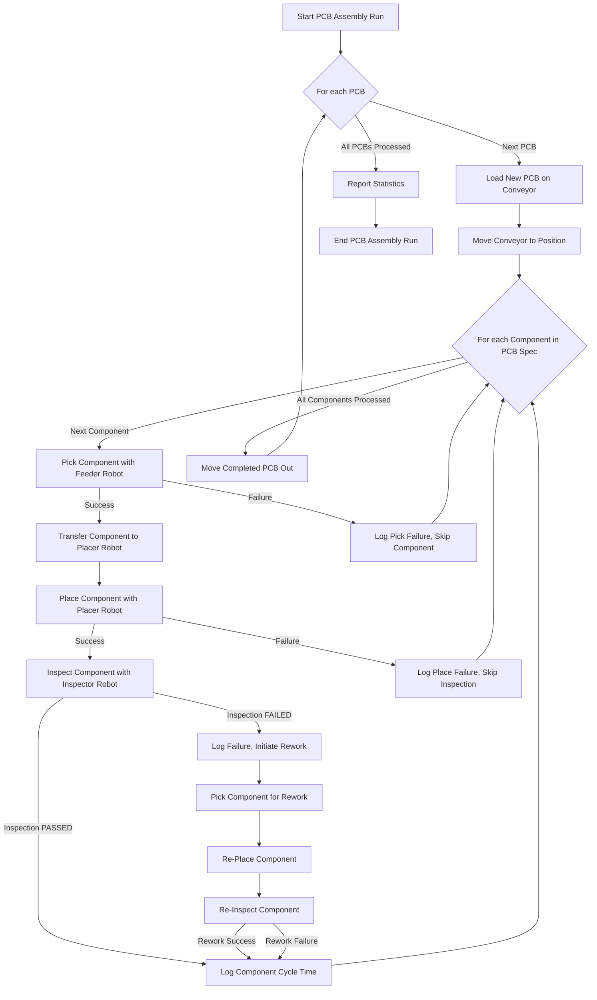
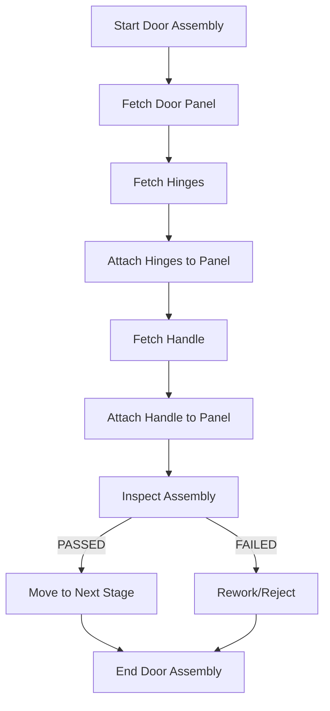

# Gantry Robot Simulation Project

## Overview

This project simulates the operations of a gantry robot system designed for various automated assembly and manufacturing tasks. It provides a framework to define, execute, and analyze complex sequences involving multiple robots, conveyor systems, and component handling. The primary vision is to offer a flexible and extensible platform for developing and testing robotic automation logic before deployment in real-world scenarios. **Note: This project is currently under active development, and many features are still being implemented.**

## Table of Contents

- [Vision](#vision)
- [Features](#features)
- [Project Structure](#project-structure)
- [Key Scenarios](#key-scenarios)
  - [PCB Assembly](#pcb-assembly)
  - [Door Assembly (Conceptual)](#door-assembly-conceptual)
  - [Engine Assembly (Conceptual)](#engine-assembly-conceptual)
- [Visual Simulation](#visual-simulation)
- [Laser Marker Integration](#laser-marker-integration)
- [Setup and Installation](#setup-and-installation)
- [How to Run](#how-to-run)
  - [Running Simulations via VS Code Tasks](#running-simulations-via-vs-code-tasks)
  - [Running Individual Scripts](#running-individual-scripts)
- [Development Progress & Roadmap](#development-progress--roadmap)
- [Logging](#logging)
- [Linting and Formatting](#linting-and-formatting)
- [Testing](#testing)
- [Contributing](#contributing)
- [License](#license)

## Vision

To create a comprehensive simulation environment that enables:
- Rapid prototyping of robotic assembly lines.
- Testing and validation of control algorithms.
- Performance analysis and optimization of manufacturing processes.
- Training and educational purposes for robotics and automation.
- Easy extension with new robot capabilities, components, and assembly scenarios.

## Features

- **Multi-Robot Coordination**: Simulates multiple gantry robots (e.g., feeder, placer, inspector). *(Core functionality in development)*
- **Component Handling**: Detailed simulation of picking, placing, and manipulating various components. *(Partially implemented for PCB assembly)*
- **Conveyor System**: Simulates conveyor belt movement for transporting items through the assembly line. *(Implemented for PCB assembly)*
- **Inspection Module**: Simulates component inspection with configurable success/failure rates for different checks (presence, alignment, polarity, solder). *(Implemented for PCB assembly)*
- **Rework Loop**: Basic simulation of rework processes for failed inspections. *(Implemented for PCB assembly)*
- **Detailed Logging**: Comprehensive logging for main processes and individual robot actions. *(Implemented)*
- **Scenario-Based Design**: Easily define and run different assembly scenarios (e.g., PCB assembly, door assembly). *(PCB assembly implemented; others conceptual)*
- **Configurable Parameters**: PCB specifications, component libraries, feeder positions are configurable. *(Implemented for PCB assembly)*
- **VS Code Integration**: Includes launch configurations and tasks for easy execution within Visual Studio Code. *(Implemented)*
- **Force Sensing Simulation**: Basic simulation of force sensing during pick and place operations. *(Partially implemented for PCB assembly)*
- **Gripper Selection**: Simulates selection of appropriate grippers based on object type. *(Implemented in SimpleGantrySimulation)*
- **Advanced Robot Kinematics**:
    - `arc_move`: Implemented in `SimpleGantrySimulation`, allowing the robot to move in a circular arc in the XY plane.
    - `spiral_move`: Implemented in `SimpleGantrySimulation`, allowing the robot to move in a spiral pattern in 3D space.
- **Laser Operations (New)**:
    - `laser_weld`: Method in `GantryRobot` (in `SimpleGantrySimulation`) to simulate linear laser welding between two points with specified parameters (speed, power, focus).
    - `laser_mark`: Method in `GantryRobot` (in `SimpleGantrySimulation`) to simulate laser marking of text at a target point with specified parameters.
- **Visual Simulation (New)**:
    - Interactive 2D visualization of the gantry robot system using Pygame.
    - Real-time visual representation of robot movements, including path tracing.
    - Color-coded display of different gripper types and object types.
    - Visual feedback for laser operations with dynamic beam rendering.
    - Support for all robot operations, including advanced movements (arc, spiral).
    - Thread-safe implementation that can run alongside simulation scenarios.
    - Ability to add, move, and remove objects in the visualization.
- **Simulated Database (In-Memory)**: Manages data for recipes, production results, errors, and KPIs. *(Implemented in `sim_database_manager.py`)*
- **Enhanced File Logging**: Structured JSON logs for errors, production results, and KPIs with log rotation. *(Implemented in `file_logger.py`)*
- **Simulated OPC Communication**: Mimics an OPC server for tag-based data exchange, with example integration in scenarios. *(Implemented in `sim_opc_server.py`)*
- **KPI Calculation & Storage**: Calculates and stores key manufacturing KPIs like OEE, availability, performance, etc., based on simulated data. *(Implemented in `kpi_calculator.py`)*
- **Simulated AWS Logging**: Generates structured JSON logs mimicking cloud logging services, with categorization and integration for various application events. *(Implemented in `aws_logger_sim.py`)*
- **UI Interaction Layer Support**: Provides an API-like service (`ui_interaction_service.py`) to expose simulation data (status, OPC tags, logs, database summaries) for potential UI visualization and limited control. *(Full implementation of control features is conceptual)*
**Many of these features are still under development or are planned for future iterations, though core robot movements and tooling capabilities are becoming more robust.**

## Project Structure

```
vscodeProject2/
├── .vscode/                    # VS Code specific settings (implicitly created)
│   ├── launch.json             # Debugger configurations
│   └── tasks.json              # Task configurations
├── AnalyzeSerialData.py        # Script for analyzing serial data (purpose to be detailed)
├── SimpleGantrySimulation      # Main entry point or core simulation logic
├── sim_database_manager.py     # Handles in-memory simulation of database tables for recipes, results, errors, and KPIs.
├── file_logger.py              # Manages structured JSON logging to files for errors, production results, and KPIs, including log rotation.
├── sim_opc_server.py           # Simulates a basic OPC server with tag storage and read/write capabilities.
├── kpi_calculator.py           # Contains functions to calculate various manufacturing KPIs.
├── aws_logger_sim.py           # Simulates sending structured JSON logs to an AWS CloudWatch-like file (`logs/aws_sim_cloudwatch.log`).
├── ui_interaction_service.py   # Provides functions to expose simulation data and limited control for a potential UI layer.
├── vscodeProject2.code-workspace # VS Code workspace file
├── improvements/               # Folder for planned or in-progress enhancements
│   └── compound_movements.py   # Defines logic for advanced robot movements like arc and spiral.
├── scenarios/                  # Contains different assembly line simulations
│   ├── door_assembly.py        # Simulation for door assembly, demonstrates arc and spiral moves.
│   ├── engine_assembly.py      # Simulation for engine assembly, now includes a laser welding step.
│   └── pcb_assembly.py         # Simulation for PCB assembly, now includes laser marking and database logging.
├── visualization/              # Contains modules for the visual simulation
│   ├── __init__.py             # Package initialization
│   ├── run_visual_sim.py       # Entry point to run simulations with visualization
│   └── visual_sim.py           # Core visualization logic using Pygame
├── README.md                   # This file
├── requirements.txt            # Project dependencies
├── laser_marker.py            # Defines base LaserMarker class and vendor-specific implementations
├── laser_marker_adapter.py    # Adapter to integrate laser markers with GantryRobot
└── tests/                      # Unit tests
    ├── test_analyze_serial_data.py
    ├── test_gantry_robot.py    # Unit tests for GantryRobot class, including laser functions.
    ├── test_sim_database_manager.py # Unit tests for the database simulation module.
    ├── test_file_logger.py     # Unit tests for the enhanced file logging module.
    ├── test_sim_opc_server.py  # Unit tests for the OPC server simulation.
    ├── test_kpi_calculator.py  # Unit tests for KPI calculation logic.
    ├── test_aws_logger_sim.py  # Unit tests for the AWS logging simulation module.
    └── test_ui_interaction_service.py # Unit tests for the UI interaction service module.
```

## Key Scenarios

### PCB Assembly

This scenario simulates the assembly of Printed Circuit Boards (PCBs). It involves picking components from feeders, placing them onto a PCB on a conveyor belt, and inspecting the placement. This is the most developed scenario currently.

**Process Flow:**



**Details from `pcb_assembly.py`:**
- **Robots Involved**: `feeder`, `placer`, `inspector`.
- **Component Library**: Defines various electronic components with properties like size, weight, and placement force.
- **Feeder Positions**: Specifies where each component is located in the feeder system.
- **PCB Specification**: A list defining which components go where on the PCB, including their position and rotation.
- **Inspection Checks**: Presence, alignment, polarity, solder quality.
- **Laser Marking**: After assembly, the inspector robot performs laser marking of a serial number on the PCB.
- **Database Logging**: Records the recipe used, production results (success/failure), and any errors encountered during the assembly process into the simulated database.
- **Metrics Tracked**: Placement accuracy, cycle times.

### Door Assembly (Conceptual)

This scenario would simulate the assembly of a door, potentially involving larger components and different types of robotic operations.
It is **partially implemented** and now demonstrates the use of `arc_move` for approaching hinge installation points and `spiral_move` for applying sealant in the `scenarios/door_assembly.py` script.

**Conceptual Flow (High-Level):**


### Engine Assembly (Conceptual)

This scenario would simulate the complex process of assembling an engine, involving multiple parts, precision fitting, and torqueing operations.
It is **partially implemented** and now demonstrates `laser_weld` for welding a critical seam on the cylinder head in the `scenarios/engine_assembly.py` script.

**Conceptual Flow (High-Level):**
```mermaid
graph TD
    EA_A[Start Engine Assembly] --> EA_B[Mount Engine Block];
    EA_B --> EA_C[Install Crankshaft];
    EA_C --> EA_D[Install Pistons & Connecting Rods];
    EA_D --> EA_E[Attach Cylinder Head];
    EA_E --> EA_F[Install Camshafts];
    EA_F --> EA_G[Attach Ancillaries (Alternator, Starter)];
    EA_G --> EA_H[Final Inspection & Testing];
    EA_H -- PASSED --> EA_I[Engine Ready];
    EA_H -- FAILED --> EA_J[Rework/Detailed Diagnostics];
    EA_I --> EA_K[End Engine Assembly];
    EA_J --> EA_K;
```

## Setup and Installation

1.  **Prerequisites**:
    *   Python 3.x installed and added to PATH.
    *   Visual Studio Code (recommended editor).

2.  **Clone the Repository (if applicable)**:
    ```bash
    # git clone <repository_url>
    # cd vscodeProject2
    ```
    If you have the files locally, navigate to the `vscodeProject2` directory.

3.  **Python Environment (Recommended)**:
    It's good practice to use a virtual environment:
    ```powershell
    python -m venv .venv
    .\.venv\Scripts\Activate.ps1
    ```
    On macOS/Linux:
    ```bash
    python3 -m venv .venv
    source .venv/bin/activate
    ```

4.  **Install Dependencies**:
    A `requirements.txt` file is provided for development tools. Install them using:
    ```bash
    pip install -r requirements.txt
    ```
    This will install development tools like `pylint` and `black`, as well as required libraries like `pygame` for the visual simulation.

5.  **VS Code Workspace Settings**:
    The `.code-workspace` file already configures Python path, formatting (black), linting (pylint), and testing (unittest). Open the `vscodeProject2.code-workspace` file in VS Code (`File > Open Workspace from File...`). VS Code might prompt you to select a Python interpreter; choose the one from your virtual environment if you created one.

## How to Run

**Note: As the project is under development, not all described scenarios or functionalities might be fully runnable or may be subject to change.**

### Running Simulations via VS Code Tasks

The project is configured with VS Code tasks for easy execution.

1.  Open the Command Palette (Ctrl+Shift+P or Cmd+Shift+P).
2.  Type `Tasks: Run Task`.
3.  Select the task you want to run, for example:
    *   **`Run SimpleGantrySimulation`**: This task executes the `SimpleGantrySimulation` script/module.
        ```json
        {
            "label": "Run SimpleGantrySimulation",
            "type": "shell",
            "command": "python",
            "args": [
                "SimpleGantrySimulation"
            ],
            "group": "build",
            "problemMatcher": []
        }
        ```

### Running Individual Scripts

You can also run Python scripts directly from the terminal (ensure your virtual environment is active).

**Example: Running the PCB Assembly Scenario**
(Assuming `SimpleGantrySimulation` or another script can trigger specific scenarios. If `pcb_assembly.py` is runnable directly and has a main block):
```powershell
python .\scenarios\pcb_assembly.py
```
Or, if it's part of the `SimpleGantrySimulation`:
```powershell
python SimpleGantrySimulation --scenario pcb_assembly
```
*(The exact command will depend on how `SimpleGantrySimulation` is structured to call different scenarios.)*

**Running Visual Simulation:**
To run a scenario with visual simulation:
```powershell
python .\visualization\run_visual_sim.py --scenario demo
```
Available scenarios include `demo`, `door_assembly`, `engine_assembly`, and `pcb_assembly`.

**Running `AnalyzeSerialData.py`**:
The purpose of `AnalyzeSerialData.py` is not fully detailed here. Assuming it takes a data file as input or connects to a serial port:
```powershell
python AnalyzeSerialData.py <arguments_if_any>
```

## Development Progress & Roadmap

**Current Status:**
- **The project is in an early to mid-stage of development.**
- Core simulation framework for gantry robots established but requires further refinement.
- PCB assembly scenario (`pcb_assembly.py`) is the most developed, featuring:
    - Component picking, placing, inspection.
    - Conveyor movement.
    - Basic rework logic.
    - Detailed logging.
- Placeholders for `engine_assembly.py` exist **and are not yet implemented**.
- `door_assembly.py` is **partially implemented** and now showcases `arc_move` and `spiral_move`.
- `engine_assembly.py` is **partially implemented** and now includes a `laser_weld` step.
- `pcb_assembly.py` now includes a `laser_mark` step for serial number etching and integration with `sim_database_manager.py` for logging recipes, results, and errors.
- `improvements/compound_movements.py` now contains the implemented logic for `arc_move` and `spiral_move`, which are utilized by `SimpleGantrySimulation`.
- `SimpleGantrySimulation`'s `GantryRobot` class now includes `laser_weld` and `laser_mark` methods.
- `sim_database_manager.py` provides an in-memory database simulation with CRUD operations for recipes, results, errors, and KPIs.
- **Visual Simulation**: A complete visualization module using Pygame has been implemented, providing a real-time graphical representation of the gantry robot's operations, advanced movements, laser operations, and object interactions.
- VS Code tasks and launch configurations are set up for existing runnable parts.
- **Unit tests** for `AnalyzeSerialData.py`, `SimpleGantrySimulation` (specifically the `GantryRobot` class, including laser functions), and `sim_database_manager.py` have been added in the `tests/` directory.

**Potential Roadmap / Future Enhancements:**
- **GUI Development**: Extend the current visualization with more interactive elements and control panels.
- **3D Visualization**: Upgrade the current 2D visualization to a full 3D representation using PyOpenGL or a similar library.
- **Further Advanced Robot Kinematics**: More realistic robot arm movements and collision detection.
- **Expanded Component Library**: Add more diverse components with complex properties.
- **Detailed Scenario Implementation**: Fully develop `door_assembly.py` and `engine_assembly.py`.
- **Data Analysis & Reporting**: Enhance `AnalyzeSerialData.py` or create new tools for in-depth analysis of simulation outputs (e.g., cycle times, failure rates, OEE).
- **Error Handling & Recovery**: More sophisticated error handling and automated recovery procedures in simulations.
- **Configuration Files**: Move more parameters (e.g., robot speeds, inspection probabilities) to external configuration files (JSON, YAML).
- **Database Integration**: Log simulation results to a database for persistent storage and trend analysis.
- **Parallel Execution**: Explore options for running parts of the simulation in parallel for performance.
- **Integration with External Tools**: Allow connection to PLCs, OPC UA servers, or other manufacturing software.
- **Machine Learning Integration**: Use ML for optimizing assembly sequences or predictive maintenance based on simulated wear and tear.
- **Comprehensive Unit and Integration Tests**: Continue to expand test coverage for all modules and scenarios.

## Logging

The system uses Python's `logging` module.
- `PCBAssemblyLine` has a `main_logger`.
- Each robot has its own logger (e.g., `Robot.feeder`, `Robot.placer`).
This allows for granular control over log output and helps in debugging specific parts of the system.

## Linting and Formatting

- **Formatter**: `black` is configured as the Python formatter.
- **Linter**: `pylint` is enabled for linting. `flake8` and `mypy` are currently disabled but configured.

It's recommended to format and lint your code before committing changes. VS Code can be configured to do this automatically on save.

## Testing

- `unittest` is the testing framework used for this project.
- Test files are located in the `tests/` directory. Currently, this includes:
    - `tests/test_analyze_serial_data.py`: Contains unit tests for the `process_serial_data` function.
    - `tests/test_gantry_robot.py`: Contains unit tests for the `GantryRobot` class from `SimpleGantrySimulation`, including its movement and laser functionalities.
    - `tests/test_sim_database_manager.py`: Contains unit tests for the CRUD operations of the in-memory database simulation module.
    - `tests/test_file_logger.py`: Contains unit tests for the `file_logger.py` module, including its helper functions and log rotation mechanism.
    - `tests/test_sim_opc_server.py`: Contains unit tests for the `SimOpcServer` class and its tag manipulation methods.
    - `tests/test_kpi_calculator.py`: Contains unit tests for the KPI calculation functions.
    - `tests/test_aws_logger_sim.py`: Contains unit tests for the AWS logging simulation module.
    - `tests/test_ui_interaction_service.py`: Contains unit tests for the UI interaction service module.
- To run all tests, navigate to the project root directory in your terminal (where `tests/` is a subdirectory) and execute:
  ```bash
  python -m unittest discover tests
  ```
  Alternatively, individual test files can be run directly, for example:
  ```bash
  python tests/test_gantry_robot.py
  python tests/test_sim_database_manager.py
  python tests/test_file_logger.py
  python tests/test_sim_opc_server.py
  python tests/test_kpi_calculator.py
  python tests/test_aws_logger_sim.py
  python tests/test_ui_interaction_service.py
  ```

Test files should be created to ensure the reliability of the simulation logic, especially for robot movements, component interactions, and scenario execution.

## Simulated Database Interactions

This project includes an in-memory simulation of a database to store and manage data related to recipes, production results, errors, and Key Performance Indicators (KPIs). The core logic is implemented in `sim_database_manager.py`.

The simulated database consists of the following "tables" (implemented as Python lists):

-   **Recipes Table (`db_recipes`)**:
    -   `recipe_id` (int, unique): Unique identifier for the recipe.
    -   `name` (str): Name of the recipe.
    -   `ingredients` (list): List of ingredients or component names.
    -   `steps` (list): List of assembly or processing steps.
    -   `created_at` (datetime): Timestamp of when the recipe was created.
-   **Results Table (`db_results`)**:
    -   `result_id` (int, unique): Unique identifier for the production result.
    -   `timestamp` (datetime): Timestamp of when the result was recorded.
    -   `recipe_id` (int): Foreign key linking to the Recipes table.
    -   `output_quantity` (int): Number of units produced.
    -   `status` (str): Outcome of the production run (e.g., "success", "failed_inspection", "aborted").
    -   `operator` (str): Identifier for the operator or automated process.
    -   `shift` (str): Production shift identifier.
-   **Errors Table (`db_errors`)**:
    -   `error_id` (int, unique): Unique identifier for the error log.
    -   `timestamp` (datetime): Timestamp of when the error occurred.
    -   `machine_id` (str): Identifier of the machine or robot that reported the error (e.g., "Robot.feeder", "GantryRobot1").
    -   `error_code` (str): Specific code for the error type.
    -   `description` (str): Human-readable description of the error.
    -   `severity` (str): Severity level (e.g., "low", "medium", "high", "critical").
-   **KPIs Table (`db_kpis`)**:
    -   `kpi_id` (int, unique): Unique identifier for the KPI record.
    -   `timestamp` (datetime): Timestamp for when the KPI was recorded.
    -   `machine_id` (str): Identifier for the machine or process the KPI relates to.
    -   `OEE` (float): Overall Equipment Effectiveness score.
    -   `availability` (float): Machine availability percentage.
    -   `performance` (float): Machine performance percentage.
    -   `quality` (float): Quality rate percentage.
    -   `cycle_time` (float): Average cycle time for a process or unit.
    -   `defect_rate` (float): Rate of defects.

The module provides CRUD (Create, Read, Update, Delete) functions for managing these records. For example, `create_recipe()`, `get_all_results()`, `create_error()`, etc. The `pcb_assembly.py` scenario demonstrates the usage of these functions for logging recipes, production results, and errors.

Currently, this is an in-memory simulation, meaning data persists only for the duration of the script's execution.

## Enhanced File Logging

The simulation now includes enhanced file logging capabilities for better traceability, debugging, and data analysis, implemented in `file_logger.py`.

-   **Structured JSON Logs**: Logs are generated in JSON format, with each entry on a new line. This facilitates easier parsing and analysis by other tools.
-   **Log Location**: All log files are stored in the `logs/` directory, created automatically if it doesn't exist.
-   **Dedicated Log Files for Different Event Types**:
    -   `logs/error.log`: Captures detailed error events. Key fields include `timestamp`, `machine_id`, `error_code`, `description`, `severity`, and optional `scenario_context`.
    -   `logs/production.log`: Records production results for each completed unit (e.g., PCB). Key fields include `timestamp`, `recipe_id`, `recipe_name`, `output_quantity`, `status`, `operator`, `shift`, and `cycle_time_seconds`.
    -   `logs/kpi.log`: Stores snapshots of Key Performance Indicators. Key fields include `timestamp`, `machine_id`, `OEE`, `availability`, `performance`, `quality`, `cycle_time`, `defect_rate`, and optional `MTBF`, `MTTR`, `throughput`.
-   **Timestamping**: All log entries are automatically timestamped with UTC time in ISO 8601 format (e.g., `YYYY-MM-DDTHH:MM:SS.ffffffZ`).
-   **Log Rotation**:
    -   A basic log rotation mechanism is implemented to manage log file sizes.
    -   When a log file (e.g., `error.log`) exceeds a predefined maximum size (currently 1MB, defined by `MAX_LOG_SIZE_BYTES` in `file_logger.py`), it is backed up.
    -   The current log is renamed (e.g., to `error.log.1`), and existing backups are shifted (e.g., `error.log.1` becomes `error.log.2`).
    -   A maximum number of backup files (currently 5, defined by `MAX_LOG_BACKUPS`) is maintained; the oldest backup is removed if this limit is exceeded.

This enhanced logging system provides a more robust and organized way to capture and manage simulation data over time.

## Simulated OPC Communication

The project includes a simulation of an OPC server to mimic data exchange between PLCs/machines and factory systems. This allows for testing control logic that would typically interact with an OPC UA or OPC DA server in a real-world industrial setting.

-   **Module**: Implemented in `sim_opc_server.py`, which provides a `SimOpcServer` class.
-   **Tag Structure**: The server manages OPC-like tags, where each tag has a `tag_id` (string), `value` (Python primitive), `timestamp` (datetime), and `quality` (string, e.g., 'Good').
-   **Core Functionality**: A global instance `sim_opc_instance` is available for other modules to interact with. Key functions include `add_tag()`, `read_tag()`, and `write_tag()`.
-   **Sample Tags**: The server initializes with sample tags representing sensor data (e.g., `SimPLC.S1.Temp`), robot states (e.g., `GantryRobot.Status`), and actuators (e.g., `Conveyor.IsRunning`).
-   **Integration**: Demonstrated in `scenarios/pcb_assembly.py`, where the scenario logic reads sensor data (like item presence) and writes actuator commands (like conveyor control) via the simulated OPC server. Due to technical limitations encountered during development, direct OPC updates from the `GantryRobot` class in `SimpleGantrySimulation.py` (e.g., for its axis positions or detailed status changes) are not currently implemented as fully as initially planned; the scenario-level interactions showcase the OPC server's capabilities.

## KPI Calculation & Storage

The project now includes a module for calculating and storing key Key Performance Indicators (KPIs) related to the simulated manufacturing process.

-   **Module**: Implemented in `kpi_calculator.py`.
-   **KPIs Calculated**:
    -   Overall Equipment Effectiveness (OEE)
    -   Availability
    -   Performance
    -   Quality
    -   Average Cycle Time
    -   Defect Rate
    -   Mean Time Between Failures (MTBF) - Uses a simplified model with severity-based repair times for downtime calculation.
    -   Mean Time To Repair (MTTR) - Uses a simplified model with severity-based repair times.
    -   Throughput (units per hour).
-   **Data Sources**: KPI calculations utilize data logged via `sim_database_manager.py` (e.g., production results, error logs) and configurable operational parameters (e.g., ideal cycle times, scheduled times) defined within `kpi_calculator.py` or passed to its functions.
-   **Storage**: Calculated KPIs are stored using `sim_database_manager.create_kpi_record()` and can also be logged to `logs/kpi.log` via `file_logger.py`.
-   **Integration**: Demonstrated in `scenarios/pcb_assembly.py`, where KPIs are calculated at the end of the simulation run based on data collected during the scenario.

## Simulated AWS Logging

The project includes a module to simulate logging to an AWS CloudWatch-like service. This allows for testing and development of structured cloud logging patterns without actual AWS integration.

-   **Module**: Implemented in `aws_logger_sim.py`.
-   **Log Format**: Log entries are structured in JSON, including `timestamp` (ISO 8601 UTC), `log_level` (e.g., INFO, ERROR), `category` (for filtering, e.g., RobotOperation, SystemEvent), `message`, and an optional `details` dictionary for context-specific data.
-   **Simulated Transmission**: Logs are written to `logs/aws_sim_cloudwatch.log`, with each JSON entry on a new line. This simulates how logs might be prepared for transmission to a cloud service.
-   **Integration & Categories**: The logger is integrated into various parts of the application (scenarios, database manager, file logger meta-logging, KPI updates) using defined categories for easy filtering and analysis.
-   **Note on Current Implementation**: This is a simulation; no actual calls to AWS services are made.

## UI Interaction Layer Support

To facilitate the development of a separate User Interface (UI) for visualizing and interacting with the simulation, a dedicated service layer (`ui_interaction_service.py`) has been implemented.

-   **Module**: Implemented in `ui_interaction_service.py`.
-   **Key Capabilities**:
    -   **Data Exposure**: Provides functions to fetch various simulation data points, including:
        -   Overall simulation status and current scenario details.
        -   Robot status and positions (primarily via OPC tag polling).
        -   Snapshots of current OPC tag values.
        -   Recent entries from various log files (error, production, KPI, AWS simulation).
        -   Summaries and full data for recipes, production results, errors, and KPIs from the `sim_database_manager`.
    -   **Data Formatting**: Data is structured in Python dictionaries, suitable for easy JSON serialization for UI consumption.
    -   **Conceptual Control**: Includes a function `set_opc_tag_value()` to allow external modification of OPC tags. Other control functions (start/stop/pause scenario) are designed as placeholders to indicate future API extension points but are not currently implemented due to the simulation's synchronous architecture.
-   **Usage**: A UI's backend component could import and use the functions from `ui_interaction_service.py` to query the simulation's state and history for display.
-   **Limitations**: Direct real-time, event-driven push updates from the simulation to a UI are not part of this layer; a UI would typically poll these service functions. Deep robot state introspection is limited by reliance on OPC tags set by scenarios rather than direct GantryRobot class modification.

## Visual Simulation

The project now includes a comprehensive visual simulation capability that provides a real-time graphical representation of the gantry robot's operations. This visualization makes it easier to understand, debug, and demonstrate the robot's movements and interactions.

### Visual Simulation Features

- **Real-time 2D Visualization**: Provides a top-down view of the gantry robot's movements using Pygame.
- **Robot Representation**: Visualizes the robot's body and current gripper with appropriate colors and sizing.
- **Path Tracing**: Shows the robot's movement history with a trailing path that fades over time.
- **Coordinate System**: Displays a grid with labeled axes to understand spatial positioning.
- **Object Visualization**: Different object types (Box, Cylinder, Sheet, Metal Part, Fragile) are displayed with distinctive shapes and colors.
- **Gripper Visualization**: Different gripper types (Suction, Parallel, Magnetic, Soft) are shown with distinctive colors.
- **Z-Axis Representation**: Objects and the robot appear smaller when at higher Z positions, creating a simple perspective effect.
- **Laser Operations Visualization**: 
  - Displays laser status (WELDING, MARKING) in the interface
  - Renders a dynamic laser beam during welding and marking operations
- **Advanced Movement Visualization**: Properly visualizes complex movements like arcs and spirals through path tracing.
- **Multi-threading Support**: Runs the visualization in a separate thread from the simulation logic, ensuring smooth rendering.
- **Thread Safety**: Uses locks to prevent race conditions when updating visual elements.

### Implementation Details

The visual simulation is implemented in the `visualization` directory:

- **`visual_sim.py`**: Core visualization module that handles rendering the robot, objects, and UI elements.
  - **`VisualSimulation`** class: Manages the Pygame window, rendering, and interaction.
  - **Key methods**:
    - `draw_robot()`: Renders the robot with proper position, orientation, and gripper.
    - `draw_objects()`: Renders all tracked objects with appropriate visual representations.
    - `add_object()`, `move_object()`, `remove_object()`: Manage objects in the visualization.
    - `run_scenario()`: Executes a simulation scenario while visualizing it.

- **`run_visual_sim.py`**: Provides a command-line interface for running different scenarios with visualization.
  - Supports running any of the implemented scenarios (PCB assembly, door assembly, engine assembly).
  - Includes a demo mode that showcases various robot capabilities.

### Monkey Patching for Visualization

The `patch_gantry_robot()` function in `visual_sim.py` enhances the `GantryRobot` class with visualization capabilities:
- Intercepts `pick_and_place()` and `move_to()` calls to update the visualization accordingly.
- Tracks objects as they are manipulated by the robot.
- Maintains visual consistency with the actual robot state.

### How to Run the Visual Simulation

The visual simulation can be run using:

```powershell
python .\visualization\run_visual_sim.py --scenario <scenario_name>
```

Available scenarios:
- `demo`: A simple demonstration of various robot movements and operations
- `door_assembly`: Visualization of the door assembly process
- `engine_assembly`: Visualization of the engine assembly process
- `pcb_assembly`: Visualization of the PCB assembly process

Example:
```powershell
python .\visualization\run_visual_sim.py --scenario demo
```

### Interaction with the Visualization

While the visualization is running:
- Press `ESC` key to exit the visualization.
- The display shows the current robot position, gripper type, and laser status (if active).
- All robot movements and operations are visually represented in real-time.

### Technical Requirements

The visual simulation requires:
- Pygame library (included in `requirements.txt`)
- Python 3.x with threading support
- Display capabilities to render the Pygame window

This visual simulation significantly enhances the project by providing an intuitive way to understand and verify the robot's behavior, making it valuable for debugging, demonstration, and educational purposes.

## Laser Marker Integration

The project includes a flexible and extensible laser marker integration system, allowing for the simulation of various vendor-specific laser markers in the gantry robot system.

### Laser Marker Architecture

The laser marker system uses a flexible class hierarchy and adapter pattern:

- **Base Class**: `LaserMarker` (abstract)
  - Defines the common interface for all laser marker implementations
  - Handles basic functionality like initialization, status tracking, settings management
  - Declares abstract methods that vendor-specific implementations must provide

- **Vendor-Specific Implementations**:
  - `KeyenceLaserMarker`: Implements Keyence-specific laser marker behavior
  - `TrumpfLaserMarker`: Implements TRUMPF-specific laser marker behavior
  - `CoherentLaserMarker`: Implements Coherent-specific laser marker behavior
  - Additional vendors can be added by implementing new subclasses

- **Adapter**: `LaserMarkerAdapter`
  - Integrates laser markers with the existing `GantryRobot` class
  - Provides a bridge between the robot and laser marker
  - Allows swapping of different laser marker implementations without changing robot code

### Key Features

- **Vendor Flexibility**: Support for different laser marker brands and models (Keyence, TRUMPF, Coherent)
- **Multiple Operation Modes**: Marking, welding, engraving, cutting
- **Model-Specific Settings**: Each laser marker model has appropriate settings and capabilities
- **Dynamic Switching**: Can change laser markers at runtime
- **Consistent Interface**: Common interface for all laser operations, regardless of vendor
- **Visualization Support**: Works with the existing visualization system
- **Laser Parameter Control**: Adjust power, speed, focus, and other parameters

### Supported Laser Types

- **Fiber Lasers**: High-power lasers for marking and welding (e.g., Keyence MD-X1500, TRUMPF TruMark 5010, Coherent PowerLine F20)
- **CO2 Lasers**: Good for marking and cutting non-metallic materials (e.g., Keyence ML-Z9500, Coherent Diamond CO2)
- **YAG Lasers**: Used for marking and engraving (e.g., TRUMPF TruMark 3000)
- **UV Lasers**: Specialized for high-precision marking

### How to Use Laser Markers

#### 1. Basic Usage with Factory Function

```python
from laser_marker import create_laser_marker

# Create a laser marker of your preferred vendor and model
keyence = create_laser_marker("keyence", "MD-F3000")
trumpf = create_laser_marker("trumpf", "TruMark 6130")
coherent = create_laser_marker("coherent", "StarFiber 150")

# Perform marking operation
keyence.mark(
    target_point=(100, 100, 10),
    text="SERIAL-123456",
    power=30,
    speed=100,
    font_size=8.0
)

# Perform welding operation
trumpf.weld(
    start_point=(150, 50, 20),
    end_point=(200, 50, 20),
    power=50,
    speed=10,
    focus_setting=0.2
)
```

#### 2. Integration with GantryRobot using Adapter

```python
from SimpleGantrySimulation import GantryRobot
from laser_marker_adapter import LaserMarkerAdapter

# Create a GantryRobot instance
gantry = GantryRobot()

# Create an adapter with a laser marker
adapter = LaserMarkerAdapter(gantry, vendor="keyence", model="MD-X1500")

# Now the robot can use the laser marker through its laser_weld and laser_mark methods
gantry.laser_weld(
    start_point=(50, 50, 20),
    end_point=(150, 50, 20),
    speed=15,
    power=45,
    focus_setting=0.0
)

gantry.laser_mark(
    target_point=(200, 200, 10),
    text="GANTRY-TEST-123",
    speed=100,
    power=30,
    font_size=5.0
)

# Switch to a different laser marker if needed
adapter.replace_laser_marker("trumpf", "TruMark 6130")
```

#### 3. Integrating with Assembly Scenarios

To add a laser marker to an assembly scenario:

```python
# Import necessary modules
from laser_marker import create_laser_marker
from laser_marker_adapter import LaserMarkerAdapter

# Inside your assembly sequence function
def engine_assembly_sequence():
    # ... existing code ...
    
    # Create a laser marker adapter with a high-power fiber laser for welding
    laser_adapter = LaserMarkerAdapter(gantry, vendor="trumpf", model="TruMark 6130")
    
    # The laser_weld method now uses the TRUMPF laser through the adapter
    gantry.laser_weld(
        start_point=weld_start_point,
        end_point=weld_end_point,
        speed=15,
        power=1800,
        focus_setting=-0.2
    )
    
    # ... continue with the rest of the sequence ...
```

### Step-by-Step: Adding a New Laser Marker to an Assembly Scenario

Here's a complete workflow for integrating a laser marker into an assembly line scenario:

1. **Import the required modules**:
   ```python
   from laser_marker import create_laser_marker
   from laser_marker_adapter import LaserMarkerAdapter
   ```

2. **Select the appropriate laser marker** based on the application needs:
   - For **marking**: Consider Keyence MD-X1500 (fiber), Coherent PowerLine F20 (fiber)
   - For **welding**: Consider TRUMPF TruMark 6130 (high-power fiber), Coherent StarFiber 150 (high-power fiber)
   - For **cutting**: Consider Keyence ML-Z9500 (CO2), Coherent Diamond CO2

3. **Create the adapter** in your assembly sequence:
   ```python
   # For marking operations on PCBs
   laser_adapter = LaserMarkerAdapter(
       robot=inspector_robot,  # Use the appropriate robot
       vendor="keyence",
       model="MD-X1500"
   )
   
   # Or for welding operations on metal parts
   laser_adapter = LaserMarkerAdapter(
       robot=gantry,
       vendor="trumpf",
       model="TruMark 6130"
   )
   ```

4. **Use the laser operations** directly through the robot's methods:
   ```python
   # For marking
   inspector_robot.laser_mark(
       target_point=(150, 100, 15),
       text=serial_number,
       speed=100,
       power=25,
       font_size=3.0
   )
   
   # For welding
   gantry.laser_weld(
       start_point=(200, 150, 20),
       end_point=(250, 150, 20),
       speed=15,
       power=1200,
       focus_setting=-0.5
   )
   ```

5. **Access advanced vendor-specific features** if needed:
   ```python
   # Get the underlying laser marker instance
   keyence_marker = laser_adapter.get_laser_marker()
   
   # Use vendor-specific methods
   keyence_marker.save_job("daily_pcb_marking", {
       "text": "TEMPLATE-TEXT",
       "position": (150, 100, 15),
       "power": 25,
       "speed": 100
   })
   
   # Later, just run the saved job
   keyence_marker.run_job("daily_pcb_marking")
   ```

6. **Switch laser markers** if needed during operation:
   ```python
   # Switch to a different laser marker when needed
   laser_adapter.replace_laser_marker("coherent", "StarFiber 150")
   ```

### Vendor-Specific Features

#### Keyence Laser Markers

Keyence laser markers support additional features like:

```python
# Create a job and save it for later use
keyence.save_job("job1", {"text": "TEST-123", "position": (100, 100, 10)})

# Load a previously saved job
keyence.load_job("job1")

# Run the currently loaded job
keyence.run_job()
```

#### TRUMPF Laser Markers

TRUMPF laser markers have their own programming model:

```python
# Create a program and save it
trumpf.save_program("program1", {"text": "TRUMPF-TEST", "position": (120, 120, 15)})

# Load a previously saved program
trumpf.load_program("program1")

# Execute the currently loaded program
trumpf.execute_program()
```

#### Coherent Laser Markers

Coherent laser markers have a job library system:

```python
# Save a job to the library
coherent.save_job("weld_job", {
    "start_point": (150, 50, 20),
    "end_point": (200, 50, 20),
    "power": 120,
    "speed": 15
})

# Load and run a job
coherent.load_job("weld_job")
coherent.run_job()
```

### Testing Laser Markers

A test script is provided to demonstrate the laser marker functionality:

```powershell
python .\tests\test_laser_marker.py
```

This script tests:
- Basic laser marker functionality
- Integration with GantryRobot via the adapter
- Examples of how to modify existing scenarios

### Implementation Details

- **`laser_marker.py`**: Defines the base `LaserMarker` class and vendor-specific implementations
  - Uses abstract base classes to ensure proper implementation
  - Provides a factory function for easy creation of laser markers
  
- **`laser_marker_adapter.py`**: Implements the adapter pattern to integrate laser markers with the GantryRobot
  - Patches the robot's methods to use the laser marker
  - Maintains backward compatibility with existing code

This architecture allows for seamless integration of new laser marker vendors and models, making the system highly extensible while maintaining a consistent interface for the gantry robot operations.

## Contributing

Contributions are welcome! Please follow these general guidelines:
1.  Fork the repository (if applicable).
2.  Create a new branch for your feature or bug fix: `git checkout -b feature/your-feature-name` or `git checkout -b fix/your-bug-fix`.
3.  Write clear, commented, and well-formatted code.
4.  Add or update tests for your changes.
5.  Ensure all tests pass.
6.  Run linters and formatters.
7.  Submit a pull request with a clear description of your changes.

## License

*(Specify your project's license here, e.g., MIT, Apache 2.0, GPL. If no license is chosen yet, you can state "License TBD" or "Proprietary".)*

Example:
This project is licensed under the MIT License - see the LICENSE.md file for details (if you create one).
