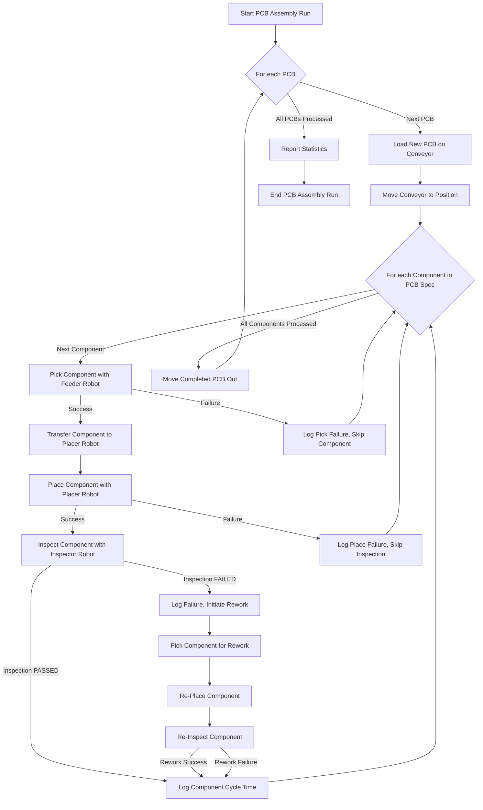
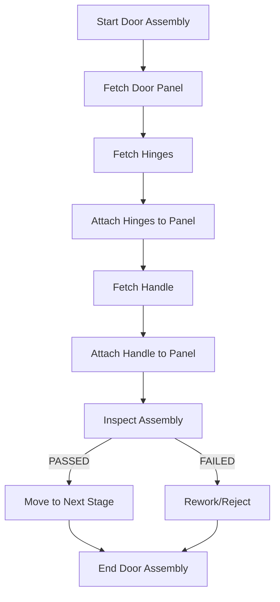

# Gantry Robot Simulation Project

## Overview

This project simulates the operations of a gantry robot system designed for various automated assembly and manufacturing tasks. It provides a framework to define, execute, and analyze complex sequences involving multiple robots, conveyor systems, and component handling. The primary vision is to offer a flexible and extensible platform for developing and testing robotic automation logic before deployment in real-world scenarios. **Note: This project is currently under active development, and many features are still being implemented.**

## Table of Contents

- [Vision](#vision)
- [Features](#features)
- [Project Structure](#project-structure)
- [Key Scenarios](#key-scenarios)
  - [PCB Assembly](#pcb-assembly)
  - [Door Assembly (Conceptual)](#door-assembly-conceptual)
  - [Engine Assembly (Conceptual)](#engine-assembly-conceptual)
- [Setup and Installation](#setup-and-installation)
- [How to Run](#how-to-run)
  - [Running Simulations via VS Code Tasks](#running-simulations-via-vs-code-tasks)
  - [Running Individual Scripts](#running-individual-scripts)
- [Development Progress & Roadmap](#development-progress--roadmap)
- [Logging](#logging)
- [Linting and Formatting](#linting-and-formatting)
- [Testing](#testing)
- [Contributing](#contributing)
- [License](#license)

## Vision

To create a comprehensive simulation environment that enables:
- Rapid prototyping of robotic assembly lines.
- Testing and validation of control algorithms.
- Performance analysis and optimization of manufacturing processes.
- Training and educational purposes for robotics and automation.
- Easy extension with new robot capabilities, components, and assembly scenarios.

## Features

- **Multi-Robot Coordination**: Simulates multiple gantry robots (e.g., feeder, placer, inspector). *(Core functionality in development)*
- **Component Handling**: Detailed simulation of picking, placing, and manipulating various components. *(Partially implemented for PCB assembly)*
- **Conveyor System**: Simulates conveyor belt movement for transporting items through the assembly line. *(Implemented for PCB assembly)*
- **Inspection Module**: Simulates component inspection with configurable success/failure rates for different checks (presence, alignment, polarity, solder). *(Implemented for PCB assembly)*
- **Rework Loop**: Basic simulation of rework processes for failed inspections. *(Implemented for PCB assembly)*
- **Detailed Logging**: Comprehensive logging for main processes and individual robot actions. *(Implemented)*
- **Scenario-Based Design**: Easily define and run different assembly scenarios (e.g., PCB assembly, door assembly). *(PCB assembly implemented; others conceptual)*
- **Configurable Parameters**: PCB specifications, component libraries, feeder positions are configurable. *(Implemented for PCB assembly)*
- **VS Code Integration**: Includes launch configurations and tasks for easy execution within Visual Studio Code. *(Implemented)*
- **Force Sensing Simulation**: Basic simulation of force sensing during pick and place operations. *(Partially implemented for PCB assembly)*
- **Gripper Selection**: Simulates selection of appropriate grippers based on object type. *(Partially implemented for PCB assembly)*
**Many of these features are still under development or are planned for future iterations.**

## Project Structure

```
vscodeProject2/
├── .vscode/                    # VS Code specific settings (implicitly created)
│   ├── launch.json             # Debugger configurations
│   └── tasks.json              # Task configurations
├── AnalyzeSerialData.py        # Script for analyzing serial data (purpose to be detailed)
├── SimpleGantrySimulation      # Main entry point or core simulation logic
├── vscodeProject2.code-workspace # VS Code workspace file
├── improvements/               # Folder for planned or in-progress enhancements
│   └── compound_movements.py   # Example: advanced robot movement logic
├── scenarios/                  # Contains different assembly line simulations
│   ├── door_assembly.py        # Simulation for door assembly
│   ├── engine_assembly.py      # Simulation for engine assembly
│   └── pcb_assembly.py         # Simulation for PCB assembly
└── README.md                   # This file
```

## Key Scenarios

### PCB Assembly

This scenario simulates the assembly of Printed Circuit Boards (PCBs). It involves picking components from feeders, placing them onto a PCB on a conveyor belt, and inspecting the placement. This is the most developed scenario currently.

**Process Flow:**



**Details from `pcb_assembly.py`:**
- **Robots Involved**: `feeder`, `placer`, `inspector`.
- **Component Library**: Defines various electronic components with properties like size, weight, and placement force.
- **Feeder Positions**: Specifies where each component is located in the feeder system.
- **PCB Specification**: A list defining which components go where on the PCB, including their position and rotation.
- **Inspection Checks**: Presence, alignment, polarity, solder quality.
- **Metrics Tracked**: Placement accuracy, cycle times.

### Door Assembly (Conceptual)

This scenario would simulate the assembly of a door, potentially involving larger components and different types of robotic operations.
*(Details for this scenario are yet to be implemented. The `scenarios/door_assembly.py` file serves as a placeholder and is **not currently functional**.)*

**Conceptual Flow (High-Level):**


### Engine Assembly (Conceptual)

This scenario would simulate the complex process of assembling an engine, involving multiple parts, precision fitting, and torqueing operations.
*(Details for this scenario are yet to be implemented. The `scenarios/engine_assembly.py` file serves as a placeholder and is **not currently functional**.)*

**Conceptual Flow (High-Level):**
```mermaid
graph TD
    EA_A[Start Engine Assembly] --> EA_B[Mount Engine Block];
    EA_B --> EA_C[Install Crankshaft];
    EA_C --> EA_D[Install Pistons & Connecting Rods];
    EA_D --> EA_E[Attach Cylinder Head];
    EA_E --> EA_F[Install Camshafts];
    EA_F --> EA_G[Attach Ancillaries (Alternator, Starter)];
    EA_G --> EA_H[Final Inspection & Testing];
    EA_H -- PASSED --> EA_I[Engine Ready];
    EA_H -- FAILED --> EA_J[Rework/Detailed Diagnostics];
    EA_I --> EA_K[End Engine Assembly];
    EA_J --> EA_K;
```

## Setup and Installation

1.  **Prerequisites**:
    *   Python 3.x installed and added to PATH.
    *   Visual Studio Code (recommended editor).

2.  **Clone the Repository (if applicable)**:
    ```bash
    # git clone <repository_url>
    # cd vscodeProject2
    ```
    If you have the files locally, navigate to the `vscodeProject2` directory.

3.  **Python Environment (Recommended)**:
    It's good practice to use a virtual environment:
    ```powershell
    python -m venv .venv
    .\.venv\Scripts\Activate.ps1
    ```
    On macOS/Linux:
    ```bash
    python3 -m venv .venv
    source .venv/bin/activate
    ```

4.  **Install Dependencies**:
    Currently, the project seems to rely on standard Python libraries. If specific packages are added (e.g., in a `requirements.txt` file), install them using:
    ```bash
    # pip install -r requirements.txt
    ```
    Based on the workspace settings, you might want to install linters and formatters:
    ```bash
    pip install pylint black
    ```
    **Note: As the project is under development, dependencies might change. A `requirements.txt` file will be added once dependencies stabilize.**

5.  **VS Code Workspace Settings**:
    The `.code-workspace` file already configures Python path, formatting (black), linting (pylint), and testing (unittest). Open the `vscodeProject2.code-workspace` file in VS Code (`File > Open Workspace from File...`). VS Code might prompt you to select a Python interpreter; choose the one from your virtual environment if you created one.

## How to Run

**Note: As the project is under development, not all described scenarios or functionalities might be fully runnable or may be subject to change.**

### Running Simulations via VS Code Tasks

The project is configured with VS Code tasks for easy execution.

1.  Open the Command Palette (Ctrl+Shift+P or Cmd+Shift+P).
2.  Type `Tasks: Run Task`.
3.  Select the task you want to run, for example:
    *   **`Run SimpleGantrySimulation`**: This task executes the `SimpleGantrySimulation` script/module.
        ```json
        {
            "label": "Run SimpleGantrySimulation",
            "type": "shell",
            "command": "python",
            "args": [
                "SimpleGantrySimulation"
            ],
            "group": "build",
            "problemMatcher": []
        }
        ```

### Running Individual Scripts

You can also run Python scripts directly from the terminal (ensure your virtual environment is active).

**Example: Running the PCB Assembly Scenario**
(Assuming `SimpleGantrySimulation` or another script can trigger specific scenarios. If `pcb_assembly.py` is runnable directly and has a main block):
```powershell
python .\scenarios\pcb_assembly.py
```
Or, if it's part of the `SimpleGantrySimulation`:
```powershell
python SimpleGantrySimulation --scenario pcb_assembly
```
*(The exact command will depend on how `SimpleGantrySimulation` is structured to call different scenarios.)*

**Running `AnalyzeSerialData.py`**:
The purpose of `AnalyzeSerialData.py` is not fully detailed here. Assuming it takes a data file as input or connects to a serial port:
```powershell
python AnalyzeSerialData.py <arguments_if_any>
```

## Development Progress & Roadmap

**Current Status:**
- **The project is in an early to mid-stage of development.**
- Core simulation framework for gantry robots established but requires further refinement.
- PCB assembly scenario (`pcb_assembly.py`) is the most developed, featuring:
    - Component picking, placing, inspection.
    - Conveyor movement.
    - Basic rework logic.
    - Detailed logging.
- Placeholders for `door_assembly.py` and `engine_assembly.py` exist **and are not yet implemented**.
- `improvements/compound_movements.py` suggests ongoing work on enhancing robot movement capabilities, **which is still conceptual**.
- VS Code tasks and launch configurations are set up for existing runnable parts.

**Potential Roadmap / Future Enhancements:**
- **GUI Development**: Implement a graphical user interface to visualize the simulation.
- **Advanced Robot Kinematics**: More realistic robot arm movements and collision detection (potentially leveraging `improvements/compound_movements.py`).
- **Expanded Component Library**: Add more diverse components with complex properties.
- **Detailed Scenario Implementation**: Fully develop `door_assembly.py` and `engine_assembly.py`.
- **Data Analysis & Reporting**: Enhance `AnalyzeSerialData.py` or create new tools for in-depth analysis of simulation outputs (e.g., cycle times, failure rates, OEE).
- **Error Handling & Recovery**: More sophisticated error handling and automated recovery procedures in simulations.
- **Configuration Files**: Move more parameters (e.g., robot speeds, inspection probabilities) to external configuration files (JSON, YAML).
- **Database Integration**: Log simulation results to a database for persistent storage and trend analysis.
- **Parallel Execution**: Explore options for running parts of the simulation in parallel for performance.
- **Integration with External Tools**: Allow connection to PLCs, OPC UA servers, or other manufacturing software.
- **Machine Learning Integration**: Use ML for optimizing assembly sequences or predictive maintenance based on simulated wear and tear.
- **Comprehensive Unit and Integration Tests**: Expand test coverage.

## Logging

The system uses Python's `logging` module.
- `PCBAssemblyLine` has a `main_logger`.
- Each robot has its own logger (e.g., `Robot.feeder`, `Robot.placer`).
This allows for granular control over log output and helps in debugging specific parts of the system.

## Linting and Formatting

- **Formatter**: `black` is configured as the Python formatter.
- **Linter**: `pylint` is enabled for linting. `flake8` and `mypy` are currently disabled but configured.

It's recommended to format and lint your code before committing changes. VS Code can be configured to do this automatically on save.

## Testing

- `unittest` is enabled as the testing framework.
- `pytest` and `nosetests` are currently disabled.

Test files should be created to ensure the reliability of the simulation logic, especially for robot movements, component interactions, and scenario execution.

## Contributing

Contributions are welcome! Please follow these general guidelines:
1.  Fork the repository (if applicable).
2.  Create a new branch for your feature or bug fix: `git checkout -b feature/your-feature-name` or `git checkout -b fix/your-bug-fix`.
3.  Write clear, commented, and well-formatted code.
4.  Add or update tests for your changes.
5.  Ensure all tests pass.
6.  Run linters and formatters.
7.  Submit a pull request with a clear description of your changes.

## License

*(Specify your project's license here, e.g., MIT, Apache 2.0, GPL. If no license is chosen yet, you can state "License TBD" or "Proprietary".)*

Example:
This project is licensed under the MIT License - see the LICENSE.md file for details (if you create one).
